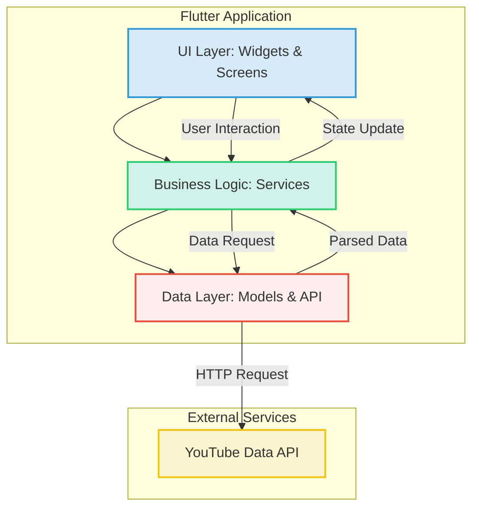
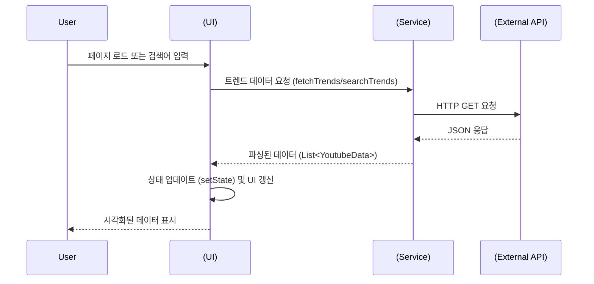

# Sight of Emotion

```
    .d8888b.  888 d8b                   888    d8b                            
   d88P  Y88b 888 Y8P                   888    Y8P                            
   888    888 888                       888                                   
   888        888 888 .d8888b   .d88b.  888888 888 88888b.   .d88b.  .d8888b  
   888        888 888 88K      d8P  Y8b 888    888 888 "88b d8P  Y8b 88K      
   888    888 888 888 "Y8888b. 88888888 888    888 888  888 88888888 "Y8888b. 
   Y88b  d88P 888 888      X88 Y8b.     Y88b.  888 888  888 Y8b.          X88 
    "Y8888P"  888 888  88888P'  "Y8888   "Y888 888 888  888  "Y8888   88888P' 
```

유튜브 게임 영상 트렌드 및 댓글의 감성 분석을 통해 사용자 반응을 시각적으로 탐색하고 이해하는 Flutter 기반의 웹 애플리케이션입니다. 이 프로젝트는 유튜브 데이터 API를 활용하여 최신 트렌드를 추적하고, 자연어 처리(NLP) 기술로 영상 제목과 댓글의 감성을 분석하여 다양한 차트와 그래프로 시각화합니다.

## ✨ 주요 기능

*   **📈 실시간 트렌드 분석**: 유튜브 '게임' 카테고리의 인기 동영상을 조회수, 좋아요 순으로 정렬하여 보여줍니다.
*   **🎭 감성 분석 및 시각화**: 영상 제목과 댓글의 텍스트를 분석하여 '기쁨', '슬픔', '분노' 등 다양한 감성을 추출하고, 결과를 파이 차트, 네트워크 그래프 등 다채로운 형태로 시각화합니다.
*   **📊 데이터 대시보드**: 수집된 데이터를 한눈에 파악할 수 있는 통합 대시보드를 제공하여 데이터 분포, 감성 동향 등을 쉽게 이해할 수 있도록 돕습니다.
*   **🔍 키워드 검색 및 필터링**: 사용자가 특정 키워드를 검색하거나 감성 필터를 적용하여 원하는 데이터만 필터링하여 볼 수 있습니다.

## 🏗️ 프로젝트 아키텍처

프로젝트는 기능별로 모듈화된 구조를 따르며, 각 레이어는 명확한 역할을 수행합니다.



*   **UI Layer (`lib/screens`, `lib/widgets`)**: 사용자와의 상호작용을 담당하는 화면과 재사용 가능한 위젯으로 구성됩니다.
*   **Business Logic Layer (`lib/services`)**: `ApiService` (API 통신), `NlpService` (감성 분석) 등 핵심 비즈니스 로직을 처리합니다.
*   **Data Layer (`lib/models`, `lib/config`)**: `YoutubeData`와 같은 데이터 모델과 API 키 등 외부 설정 값을 관리합니다.

## 🌊 데이터 흐름

애플리케이션의 데이터는 사용자의 요청으로부터 시작하여 API 호출, 데이터 처리, 그리고 UI 업데이트의 순서로 흐릅니다.



## 🚀 실행 방법

### 사전 준비

1.  Flutter SDK를 설치합니다. ([설치 가이드](https://flutter.dev/docs/get-started/install))
2.  프로젝트를 클론합니다: `git clone <repository-url>`
3.  `lib/config/api_keys.dart` 파일에 유효한 YouTube API 키를 입력합니다.

    ```dart
    // lib/config/api_keys.dart
    const String youtubeApiKey = 'YOUR_YOUTUBE_API_KEY';
    ```

### 웹 애플리케이션 실행

아래 명령어를 실행하여 Chrome 브라우저에서 웹 애플리케이션을 실행합니다.

```bash
flutter run -d chrome
```

## 🐍 Python 백엔드 (보조)

`flask` 디렉토리에는 데이터 수집 및 API 제공을 위한 Python 기반의 Flask 백엔드가 포함되어 있습니다. 현재 Flutter 앱은 YouTube API를 직접 호출하지만, 이 백엔드는 아래와 같은 목적으로 활용될 수 있습니다.

*   **데이터 사전 수집 및 캐싱**: YouTube API 할당량을 효율적으로 사용하기 위해 주기적으로 데이터를 수집하여 자체 데이터베이스(`youtube_trends.db`)에 저장합니다.
*   **독자적인 API 서버 운영**: Flutter 앱이 YouTube API 대신 자체 서버와 통신하도록 구조를 변경할 때 사용할 수 있습니다.

Flask 서버를 실행하려면 `flask` 디렉토리로 이동하여 필요한 라이브러리를 설치하고 실행합니다.

```bash
cd flask
pip install -r requirements.txt
flask run
```
